Cornershop's backend test
=========================

The project consists of three main apps:
1. The `users` app contains the model for users, as well as the views and templates for user signup, login, logout,
   and profile.
2. The `menus` app contains the models, views and templates used for menu creation.
3. The `slack` app contains the integration with the Slack API, allowing to send the menu of the day to the associated
workspace members. Currently, there's no way of associating slack users with system users beyond seeing the registered names when users select a menu option.

First, users can be created either as Manager (who can create menus, send reminders, see other employees selections) or Employee (normal users that can only see and select a menu option, receive Slack reminders). This separation is pure logical, as both use the same model (Employee model), the only difference is the `is_staff` field, being True for managers and False for normal employees.

Here's the index page:
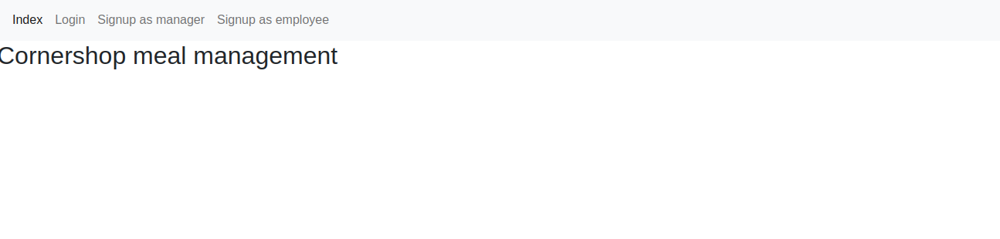

As mentioned, you can signup as either manager or employee. In this example we signup as manager. The templates are exactly the same. The views are almost equal, except for setting the `is_staff` attribute to True for the Manager signup.
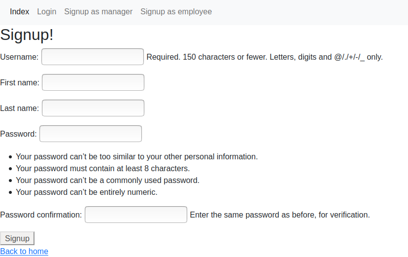

For already signed up users, this is the login page:
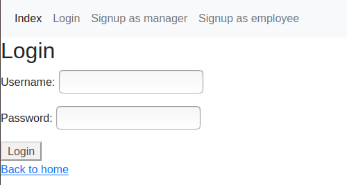

Either after login in or signing up, you're redirected to the profile page, where we can see all the links to the different actions:
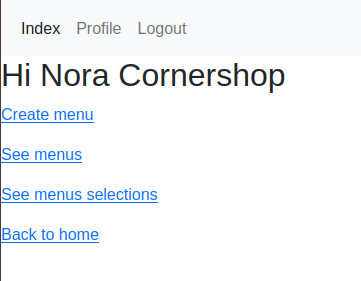

If we click the "Create menu" option, we are presented with a form to enter the date for the menu, and dynamically add different options:
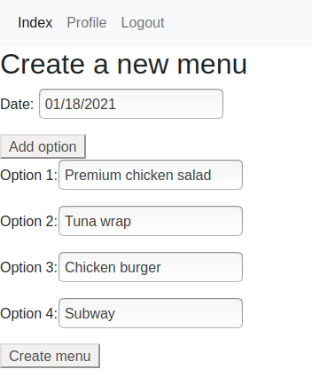

After that, we can see the list of different menus created:
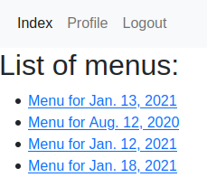

If we click the menu we just created, we can see its  options and send the reminders to all users.
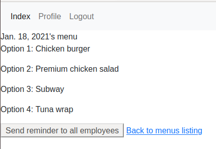

If we move to slack, we can see reminder in the slackbot's chat:
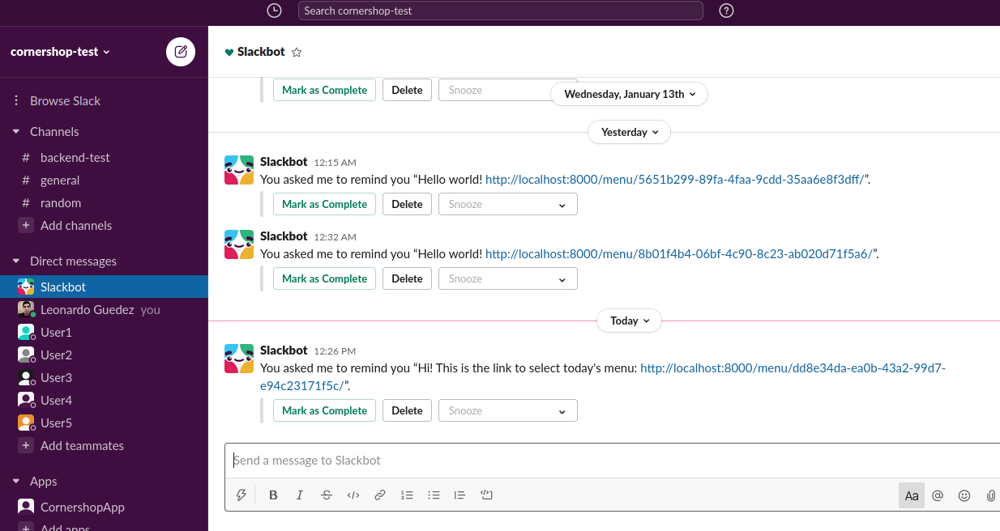

If we click the link, we are taken to the screen to select the option from that menu:
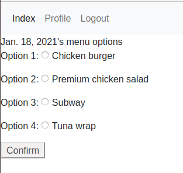

If time's beyond 11AM CLT, we no selection is made and this message is shown:
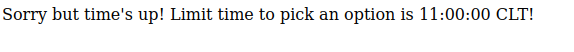

Otherwise, we're acknowledged that the selection was registered succesfully:
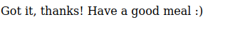

From the manager tab, we can now list the different menu selections ("See menus selections" link)
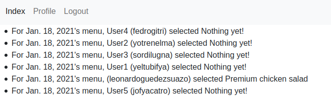

Just for the sake of the example, here's the reminder for another Slack user called "User1"
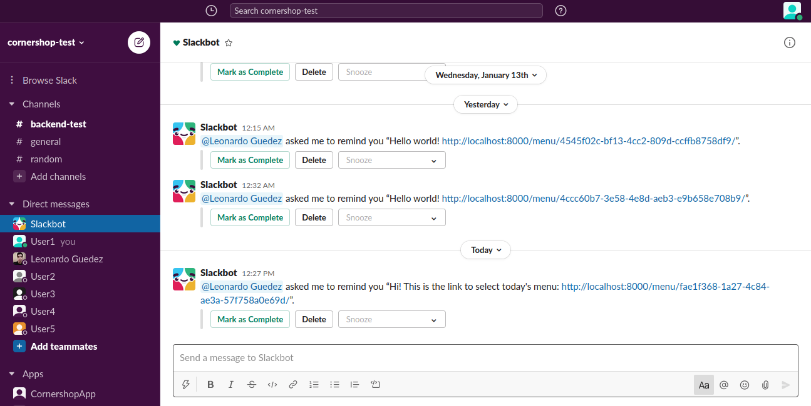

After more users select their option, the menus selections page indicates so, showing "Nothing yet" for those who have not yet selected an option:
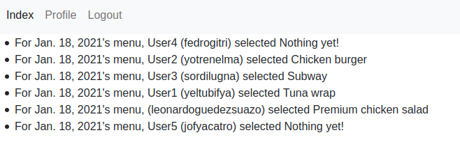

Things to improve:
==================

1. After finishing the application, I realized that I could've simply used the email for associating the system user with the slack user, assuming they were equal.
2. Take more care of the slack retry logic, as we run the risk of being more rate-limited for more users.
3. Deploy to some web platform, like Heroku.
4. Add tests for functionality like login out, login in, see menu, and some other things that didn't consider too critical.
5. Improve the obviously bad UI/UX.
